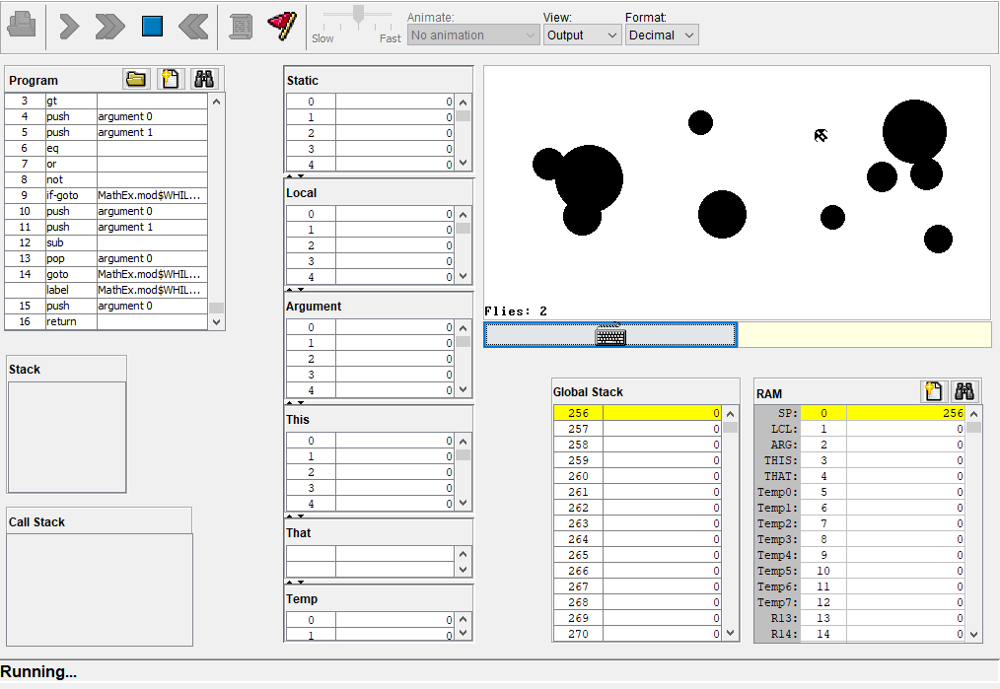

Project 9: High-Level Programming

http://www.nand2tetris.org/course.php
http://www.nand2tetris.org/09.php

* Application "Fly" written in JACK language.
* Player controls a spaceship that navigates through randomly generated maps.
* Inspired by Star Control games.

